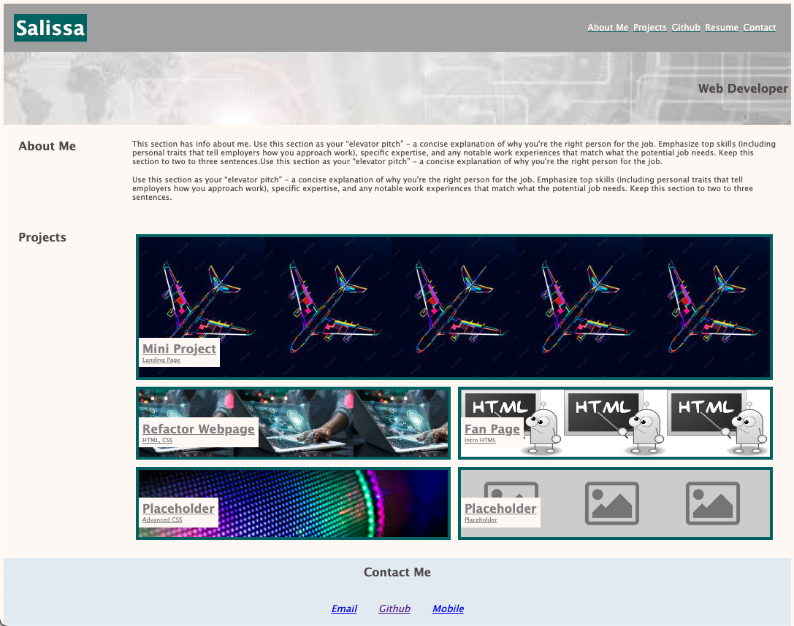

# Portfolio

## Create Portfolio Webpage

Goal: Create a portfolio webpage 

Actions:
1. Build a portfolio webpage that highights developers projects for potential employers
2. Include developers name, photo/avatar, links to sections: about developer, projects, and contact information
3. Structure HTML & CSS to flow logically
4. Ensure functionality of all links: navigation, projects and contact
5. When user clicks navigation tabs the UI scrolls to corresponding section 
6. Size the first project picture to be larger than the others
7. Projects are to have titles and link to the deployed application
8. Ensure a responsive layout that adjusts/adapts to various viewports
9. Add comments to HTML & CSS for understanding

## Demo

https://salissa4.github.io/Portfolio/

## Credits

Edited: Tomas Diaz https://github.com/tomasdiaz83

## License

MIT License

Copyright (c) [2022] [Salissa4]

Permission is hereby granted, free of charge, to any person obtaining a copy
of this software and associated documentation files (the "Software"), to deal
in the Software without restriction, including without limitation the rights
to use, copy, modify, merge, publish, distribute, sublicense, and/or sell
copies of the Software, and to permit persons to whom the Software is
furnished to do so, subject to the following conditions:

The above copyright notice and this permission notice shall be included in all
copies or substantial portions of the Software.

THE SOFTWARE IS PROVIDED "AS IS", WITHOUT WARRANTY OF ANY KIND, EXPRESS OR
IMPLIED, INCLUDING BUT NOT LIMITED TO THE WARRANTIES OF MERCHANTABILITY,
FITNESS FOR A PARTICULAR PURPOSE AND NONINFRINGEMENT. IN NO EVENT SHALL THE
AUTHORS OR COPYRIGHT HOLDERS BE LIABLE FOR ANY CLAIM, DAMAGES OR OTHER
LIABILITY, WHETHER IN AN ACTION OF CONTRACT, TORT OR OTHERWISE, ARISING FROM,
OUT OF OR IN CONNECTION WITH THE SOFTWARE OR THE USE OR OTHER DEALINGS IN THE
SOFTWARE.

## Badges

